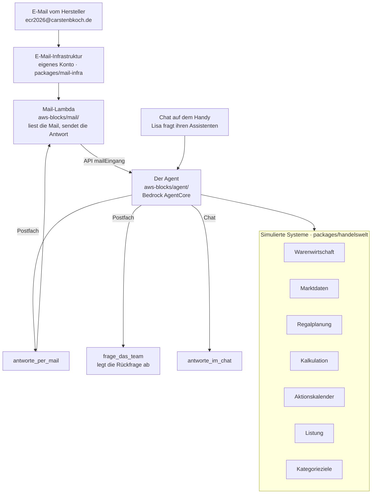

# Warum Dein KI-Agent noch keine Aufgaben für Dich übernimmt

**…und wie Du dahin kommst.** — Vortrag auf der ECR in Motion 2026, Bonn,
16. September 2026.

Lisa Berger ist Category Managerin für Schokolade & Pralinen bei einer
Lebensmittelkette. An einem Freitagnachmittag bekommt sie eine E-Mail: Ein
Hersteller will ein neues Produkt exklusiv einführen. Einkaufspreis,
Verkaufspreis, Mindestabnahme, Wunschtermin. Rückmeldung bis Ende nächster
Woche.

Der Vortrag geht dieser einen Mail nach — und zeigt live, was ein Agent damit
anfangen kann, was er dabei erfindet, und woran es liegt. Das Publikum schreibt
selbst an den Agenten und sieht die Antworten auf der Leinwand.

| Block | | |
|---|---|---|
| 1 | **Provokation** | KI wird Dir Deinen Job wegnehmen |
| 2 | **Entwarnung** | …wird Dir Deinen Job wegnehmen |
| 3 | **Beweis** | KI wird Dir Deinen Job *erleichtern* |
| 4 | **Veränderung** | KI wird Deinen Job *verändern* |

## Was in diesem Repository liegt

Vier Dinge, und sie hängen zusammen:

| | Wo | Was |
|---|---|---|
| **Die Präsentation** | `packages/presentation/src/` | Die Folien als Web-App — Live-View für den Beamer, Operator-View für den zweiten Bildschirm, Teilnehmersicht fürs Handy. Die Foliendaten in `src/slides/data.ts` sind die Quelle der Wahrheit, auch fürs Storyboard. |
| **Der Agent** | `packages/presentation/aws-blocks/agent/` | Eine Definition auf Bedrock AgentCore für beide Eingänge, Postfach und Chat auf dem Handy. Die Mail-Lambda in `aws-blocks/mail/` nimmt Mails nur an und verschickt die Antworten — siehe [Wie es gebaut ist](#wie-es-gebaut-ist). |
| **Die simulierten Systeme** | `packages/handelswelt/` | Warenwirtschaft, Marktdaten, Regalplanung, Kalkulation, Aktionskalender, Listung und die Kategorieziele — jedes hinter einem Port, der einen `Befund` liefert statt zu werfen. Dazu 81 Artikel Sortiment und das Zeitmodell. |
| **Die AWS-Infrastruktur** | `packages/infra/`, `packages/presentation/aws-blocks/index.cdk.ts` | Bootstrap (OIDC-Rolle für den Deploy, Hosted Zone, Marken-Eimer) und die CDK-Schicht des Vortrags. Der Mailempfang liegt in einem anderen Konto; seine Vorlage steht in `packages/mail-infra/` und wird von hier **nicht** ausgerollt. |

Dazu: `packages/docs/` mit dem Storyboard und den **Messungen** —
was der Agent in 85 echten Läufen tatsächlich geantwortet hat, mit Zahlen.
Zwei weitere Messungen, zu den Szenarien und zu den Kategoriezielen, liegen in
`packages/presentation/messungen/`. Jeder Messordner nennt den Befehl, der ihn
erzeugt.

Und eine Datei, die an drei Stellen gleichzeitig auftritt:
`packages/presentation/aws-blocks/mail/anhang.md`. Sie ist der Abspann des
Vortrags — die letzte Folie zeigt ihn, die letzte Seite des PDFs druckt ihn,
und unter jeder Antwortmail steht er als reiner Text. Wer dort einen Link
ändert, ändert alle drei.

## Wie es gebaut ist

Zwei Eingänge, **ein** Agent, ein Modell, dieselben **acht** Fachwerkzeuge.
Was den Agenten im Postfach von dem im Chat unterscheidet, ist allein, **womit
er antworten kann** — das Antwortwerkzeug entscheidet über den Kanal und damit
darüber, was er sagen darf.



Der Agent läuft auf `global.anthropic.claude-opus-4-8`. Claude Sonnet 4.6
steht als Rückfall dahinter: Blocks nimmt das erste Modell der Liste, das die
Gesundheitsprüfung besteht. Im Postfach heißt er `post`, im Chat `berater`.
Daneben gibt es für Abschnitt 14 eine dritte Stufe, `roh`: dasselbe Modell
ohne Fachprompt und ohne Fachwerkzeuge.

Die Mail-Lambda ruft den Agenten nicht selbst auf, sondern übergibt die Mail
über die API `mailEingang` (geschützt mit `DECK_TOKEN`). Zum Senden ruft der
Agent wiederum die Lambda auf, denn nur deren Rolle darf im Konto der Domain
senden. Außerhalb des Vortragsfensters antwortet die Lambda selbst mit einem
festen Text, und kein Modell läuft an.

**Die Systeme sind simuliert. Die Arbeit des Agenten ist es nicht.** Welches
System er befragt, in welcher Reihenfolge und was er aus den Antworten schließt,
entscheidet er selbst.

Drei Eigenschaften, die nicht zufällig so sind:

- **Ein Port wirft nicht.** Jedes System antwortet mit einem `Befund` — bei
  Erfolg mit `quelle` und `stand`, sonst mit einem Grund, den der Agent
  aussprechen kann. Ein Fehler, den die Werkzeugschleife verschluckt, kommt als
  erfundene Zahl wieder heraus.
- **Die Vertraulichkeitsregel steht am Werkzeug, nicht im Prompt.** Sie gilt
  nicht für den Agenten, sondern für den Kanal: Eine Mail geht an einen
  Außenstehenden, eine Chatnachricht an Lisa selbst. Wer das Werkzeug nicht hat,
  kann die Regel nicht verletzen.
- **`frage_das_team` trennt die Adressaten.** Was der Agent intern klären muss,
  verlässt den Lauf auf einem eigenen Weg: Der Absender erfährt, *dass* eine
  Rückfrage läuft, nie ihren Wortlaut. Ohne diese Trennung fragte der Agent den
  Lieferanten nach den eigenen Zahlen — genau das ist passiert.

  Den Vorgang hält das **nicht** an: Die Frage wird im Backend abgelegt
  (`api.lisaFragen`), die Antwort an den Absender geht trotzdem hinaus. Eine
  Oberfläche, die diese Fragen anzeigt, gibt es noch nicht. Das Anhalten mit
  `interrupt()`, bis ein Mensch geantwortet hat, ist gebaut, aber ausgeschaltet
  (`anhalten` in `aws-blocks/agent/antwort.ts`) — ohne diese Oberfläche bliebe
  ein angehaltener Vorgang für immer stehen.

## Lokal laufen lassen

Node 24 (siehe `.nvmrc`) und pnpm 12:

```bash
nvm use
pnpm install
pnpm --filter @ecr-talk/presentation dev
```

| Fenster | Adresse | Zweck |
|---|---|---|
| **Teilnehmersicht** | `localhost:5180/` | Was das Publikum auf dem Handy sieht. Die Wurzel gehört ihnen: Wer die Adresse zugerufen bekommt, landet hier und nicht auf der Leinwand. |
| **Live-View** | `localhost:5180/audience` | Auf den Beamer. Feste Bühne 1920×1080, skaliert sich auf jedes Bild. |
| **Operator-View** | `localhost:5180/operator` | Auf den zweiten Bildschirm. Vorschau der aktuellen und nächsten Folie, Sprechernotizen, Uhr, Foliensprung. |
| **Druckfassung** | `localhost:5180/papier` | Der ganze Vortrag als Dokument — daraus entsteht das PDF. Nicht verlinkt; nur der Bauprozess ruft sie auf. |

`/vortrag` leitet auf das fertige PDF weiter; lokal gibt es das erst nach
`pdf` (siehe unten).

Zwei Parameter, die an jeder dieser Adressen gelten:

- `?slide=13.1` steuert eine Folie direkt an — Abschnitt und Panel, beide ab 1
  gezählt. Vom Steuerpult aufgerufen nimmt es Leinwand und Handys mit.
- `?local` zwingt Leinwand und Steuerpult auf den `BroadcastChannel`, falls am
  Vortragsabend das Netz ausfällt. Die Teilnehmer sind dann außen vor, der
  Vortrag läuft weiter.

**Die Teilnehmersicht ist nur im Vortragsfenster aktiv.** Das Fenster öffnet
sich im Steuerpult: „Start jetzt" ab sofort, „18:00" heute von 17:50 bis
19:50 Uhr (Europe/Berlin) — zehn Minuten Vorlauf vor dem Vortrag. Zwei Stunden nach dem Start schließt es von selbst. Außerhalb
zeigt die Wurzel eine Abschlussseite mit PDF und Material aus
`aws-blocks/mail/anhang.md`, und das Backend lehnt Antworten, Chat und
Mailagent ab, ohne ein Modell zu rufen. Folienstand und Zeitplan bleiben lesbar,
damit die Leinwand schon vor dem Start der Steuerung folgt. Nach einem frischen
Deployment ist das Fenster zu — und lokal mit `dev:blocks` genauso, bis im
Steuerpult „Start jetzt" gedrückt ist.

Ohne Backend laufen die Folien, aber gekoppelt ist dann nichts: Leinwand und
Steuerpult folgen einander nur mit `?local` (im selben Browser), und die
Teilnehmersicht bleibt stumm. Für alles andere braucht es das Blocks-Backend
aus dem nächsten Abschnitt. Wer klickt, ist egal — Leinwand oder Steuerpult.

Steuerung: `→` / `Leertaste` / `Bild ab` vor, `←` / `Bild auf` zurück, `Pos1` /
`Ende` an die Ränder. Bild-auf und Bild-ab heißt: handelsübliche
Presenter-Clicker funktionieren. `F` schaltet die Live-View auf Vollbild.

### Damit der Agent auch wirklich antwortet

Die Folien laufen ohne alles. Der Agent nicht — er braucht drei Dinge:

**1. Das Blocks-Backend**, denn dort lebt er:

```bash
pnpm --filter @ecr-talk/presentation dev:blocks
```

Das startet Backend **und** Oberfläche — beides zusammen auf
`localhost:3000`, die Ansichten unter denselben Pfaden wie oben. Intern läuft
die Oberfläche auf 3100; diese Adresse nicht öffnen, dort fehlt das Backend.
Der `pnpm dev` von oben wird dafür nicht gebraucht. Läuft er trotzdem, spricht
er mit diesem Backend.

**2. AWS-Zugangsdaten in der Umgebung dieses Servers.** Ohne sie scheitert
Bedrock still und AWS Blocks fällt auf seinen eingebauten Attrappen-Provider
zurück — im Chat steht dann wörtlich *„This is a canned mock response. No real
model was called."* Das ist kein Fehler, sondern der Rückfall. Er sieht nur
genauso aus wie einer.

```bash
AWS_PROFILE=<dein-profil> pnpm --filter @ecr-talk/presentation dev:blocks
```

**3. Zugriff auf das Modell.** Der Agent läuft auf
`global.anthropic.claude-opus-4-8` über ein globales Bedrock-Inferenzprofil.
Ob Dein Konto es hat:

```bash
aws bedrock list-inference-profiles --region eu-central-1 \
  --query "inferenceProfileSummaries[?contains(inferenceProfileId,'opus')].inferenceProfileId"
```

Ein echter Lauf des Postfach-Agenten gegen die Hallbach-Mail prüft genau die
Konfiguration, die auch ausgerollt wird — etwa eine Minute, gut zehn Cent:

```bash
AWS_PROFILE=<dein-profil> pnpm --filter @ecr-talk/presentation modell:test
```

Der **Mailweg** läuft lokal nicht: Er braucht die E-Mail-Infrastruktur aus
`packages/mail-infra/` in einem AWS-Konto. Den Agenten dahinter gibt es lokal
trotzdem — `postfach` beantwortet die Hallbach-Mail und druckt, was
hinausginge, ohne etwas zu senden:

```bash
AWS_PROFILE=<dein-profil> pnpm --filter @ecr-talk/presentation postfach
```

## In der eigenen AWS-Umgebung hosten

### Ein Profil anlegen

Alle Befehle hier nehmen `AWS_PROFILE`. Ein Eintrag in `~/.aws/config`:

```ini
[profile ecrtag]
region = eu-central-1
output = json
```

Wie die Anmeldedaten dazukommen, hängt von Deiner Organisation ab. Mit
IAM Identity Center (SSO):

```ini
[sso-session meine-org]
sso_start_url = https://<deine-org>.awsapps.com/start
sso_region = eu-central-1
sso_registration_scopes = sso:account:access

[profile ecrtag]
sso_session = meine-org
sso_account_id = <konto-id>
sso_role_name = <rollenname>
region = eu-central-1
output = json
```

Danach `aws sso login --profile ecrtag`. Prüfen:

```bash
AWS_PROFILE=ecrtag aws sts get-caller-identity
```

### Bootstrap: die Dinge, die vor dem ersten Deploy stehen müssen

`packages/infra/` legt an, was ein Workflow nicht selbst anlegen kann — die
Rolle, die er annimmt, gibt es sonst noch nicht, wenn er sie braucht:

- die **OIDC-Rolle** für GitHub Actions, eingeschränkt auf den Hauptzweig und
  die Umgebung `prod` genau dieses Repositories,
- die **Hosted Zone**, gegen die das Zertifikat geprüft wird,
- einen privaten **Eimer für Markenmaterial** (Schrift und Logo liegen nicht im
  Repo).

Domain, Region und Repo stehen in `packages/infra/config.ts`. Die Domain
steht außerdem an einigen Stellen, die sie als Text zeigen oder prüfen —
`git grep carstenbkoch` findet sie, darunter den Mail-Absender in
`aws-blocks/mail/konfig.ts`, den Abspann `aws-blocks/mail/anhang.md` und die
Erreichbarkeitsprüfung in `.github/workflows/deploy.yml`.

```bash
AWS_PROFILE=ecrtag pnpm --filter @ecr-talk/infra run deploy
```

Auch hier `run deploy`: `pnpm deploy` ist ein eingebauter pnpm-Befehl (siehe
unten).

### Die Anwendung ausrollen

```bash
DECK_TOKEN="..." AWS_PROFILE=ecrtag pnpm --filter @ecr-talk/presentation run deploy
```

Das stellt CloudFront und S3 für die App bereit, AppSync Events für die
Fernsteuerung und den Agenten auf Bedrock AgentCore — und die Mail-Lambda,
wenn die drei Werte aus dem nächsten Abschnitt gesetzt sind.

Der Deploy-Workflow (`.github/workflows/deploy.yml`) tut dabei mehr als
ausrollen, und die Reihenfolge ist jedes Mal teuer erkauft worden:

1. Er prüft die Typen, holt Schrift und Logo aus dem privaten Eimer und
   **bricht ab**, wenn das Logo fehlt — eine Seite ohne Marke fällt sonst erst
   am Beamer auf.
2. Er prüft die Druckfassung, **bevor** er ausrollt.
3. Er baut das PDF aus einem lokal ausgelieferten `dist` und rollt es mit aus.
   Es liegt danach unter **`/vortrag`**, nicht nur als Artefakt am Lauf.
4. Er prüft danach Seite, Logo, Schrift und PDF auf HTTP 200.

**`DECK_TOKEN` nicht vergessen** — ohne das Geheimnis kann jeder mit der Adresse
die Folien weiterklicken. Die CDK-Schicht warnt beim Synthetisieren, und die
Operator-View zeigt im Kopf, ob die Steuerung geschützt ist.

> `pnpm run deploy`, nicht `pnpm deploy`. Letzteres ist ein eingebauter
> pnpm-Befehl und verdeckt das Skript aus der `package.json`.

Zum Ausprobieren ohne vollen Deploy:

```bash
AWS_PROFILE=ecrtag pnpm --filter @ecr-talk/presentation sandbox
```

### Der Mailweg, wenn Du ihn willst

Der Vortrag läuft auch ohne: Der Chat auf dem Handy zeigt denselben Agenten mit
denselben Werkzeugen. Wer die Teilnehmer aber wirklich per E-Mail schreiben
lassen will, braucht **`packages/mail-infra/`** — den Stack, der im Konto der
Domain Mail annimmt, in S3 legt und den Eingang meldet. Dieses Repository
rollt ihn nicht aus; die README dort beschreibt die Schritte. Die Hälfte im
Vortragskonto, die Mail-Lambda, legt `index.cdk.ts` selbst an.

Der Mailweg ist nur im Vortragsfenster offen. Davor und danach beantwortet die
Lambda jede Mail mit einem festen Text (`aws-blocks/mail/ruhe.ts`), ohne den
Agenten zu wecken.

**Rechne einen Werktag Vorlauf ein.** Ein neues AWS-Konto steht in der
SES-Sandbox, und die beschränkt das **Senden** auf verifizierte Adressen,
200 Nachrichten pro Tag und eine pro Sekunde. Der Empfang ist davon nicht
betroffen — die Mails kommen an, der Agent arbeitet, nur die Antwort geht nicht
hinaus. Das sieht aus wie ein Zustellfehler und ist keiner.

Für einen Saal voller Menschen hilft Verifizieren nicht: Jede Adresse müsste
selbst einen Bestätigungslink anklicken. Also
[Produktionszugriff beantragen](https://docs.aws.amazon.com/ses/latest/dg/request-production-access.html),
bevor Du planst. Für eine Probe mit den eigenen Adressen reicht die Sandbox.

Drei Werte kommen als GitHub-Secrets zurück: `MAIL_ACCESS_ROLE_ARN`,
`MAIL_BUCKET` und `MAIL_TOPIC_ARN`. Fehlt auch nur einer, legt die CDK-Schicht
die Mail-Lambda gar nicht erst an — ein halb verdrahteter Mailweg wäre
schlimmer als gar keiner.

## Prüfen

```bash
pnpm --filter @ecr-talk/handelswelt run ports:test      # die Systeme gegen die Folien
pnpm --filter @ecr-talk/handelswelt run daten:test      # tragen die Daten die Zahlen der Folien?
pnpm --filter @ecr-talk/presentation run buendel:test   # hat die Mail-Lambda alles im Bündel?
pnpm --filter @ecr-talk/presentation run mail:test      # der Mailweg, gegen eine Attrappe
pnpm --filter @ecr-talk/presentation run fenster:test   # außerhalb des Vortragsfensters ist alles zu
pnpm --filter @ecr-talk/presentation run papier:test    # trägt jede Folie auch im PDF?
pnpm --filter @ecr-talk/presentation run buehne:test    # sitzt die Bühne auf jedem Format?
pnpm --filter @ecr-talk/presentation run sperr:test     # folgt das Handy nach dem Sperren wieder?
AWS_PROFILE=… pnpm --filter @ecr-talk/presentation run modell:test   # ein echter Lauf gegen Bedrock
```

`buehne:test` und `sperr:test` steuern einen Browser gegen ein laufendes
`dev:blocks` auf `localhost:3000`; eine andere Adresse steht als erstes
Argument hinter dem Skriptnamen. `sperr:test` schaltet dort Folien weiter —
also nicht gegen einen Server laufen lassen, an dem gerade jemand probt.

`papier:test` läuft im Deploy **vor** dem Ausrollen: Er findet die Folien, die
ohne Publikum nichts zeigen — QR-Codes, Live-Auswertungen, Sprechertexte, die
mit dem Raum reden. Fehlt für eine davon die Angabe `papier`, entstünde eine
Seite, die den Leser in die Irre führt, und das fällt sonst niemandem auf.

`modell:test` ist der einzige, der Geld kostet, und der einzige, der findet, wenn
ein Modell die Konfiguration nicht mehr annimmt. Die anderen laufen gegen
Attrappen und bleiben grün, während jeder echte Aufruf scheitert — das ist
genau so passiert, beim Wechsel von Sonnet auf Opus.

## Storyboard und Screenshots

```bash
pnpm --filter @ecr-talk/docs storyboard                 # aus den Foliendaten erzeugt
pnpm --filter @ecr-talk/presentation shots              # alle Folien als PNG
pnpm --filter @ecr-talk/presentation pdf                # der Vortrag als Dokument
```

`shots` und `pdf` brauchen eine laufende Oberfläche, Standard ist
`localhost:5180` aus `pnpm dev`; eine andere Adresse steht als erstes Argument
hinter dem Skriptnamen.

`shots` meldet auch, welche Folien zu voll für die Bühne sind. Es blättert
durch die Leinwand und nimmt damit ein angeschlossenes Backend mit.

`pdf` druckt die Route `/papier` — echter Text, keine Screenshots, also
durchsuchbar und vorlesbar. Das Ziel ist das zweite Argument, Standard
`dist/ecr-in-motion-2026.pdf`. Es bricht ab, wenn eine Seite überliefe; ein
Überlauf im PDF schneidet sonst stillschweigend ab. Folien, die sich über mehrere Klicks aufbauen, erscheinen
darin nur in ihrem Endstand.

## Messungen wiederholen

Die ersten drei laufen gegen Bedrock, kosten echtes Geld und brauchen
`AWS_PROFILE`. Was sie erzeugen und wie man es liest, steht in den READMEs der
Messordner.

```bash
pnpm --filter @ecr-talk/presentation gegenueberstellung   # Hallbach, mit und ohne Ziele, je fünfmal
pnpm --filter @ecr-talk/presentation ziele:gegentest      # Morgenrot, mit und ohne Ziele, je dreimal
pnpm --filter @ecr-talk/presentation szenarien            # alle vierzehn Szenarien einmal
pnpm --filter @ecr-talk/presentation kosten               # sechs Rückfragen gegen eine Nachricht, offline gerechnet
```

## Hinweis zum Sortiment

`packages/handelswelt/src/daten/sortiment.ts` ist erzeugt, nicht von Hand
gepflegt. Vorlage, Zuordnungsliste und Erzeuger liegen **ausserhalb** dieses
Repos; hier steht nur das Ergebnis — 81 Artikel mit echten Warengruppen, Größen
und Preislagen, aber ohne einen einzigen echten Markennamen. Was die Folien
aus diesen Daten behaupten, prüft `daten:test`.
