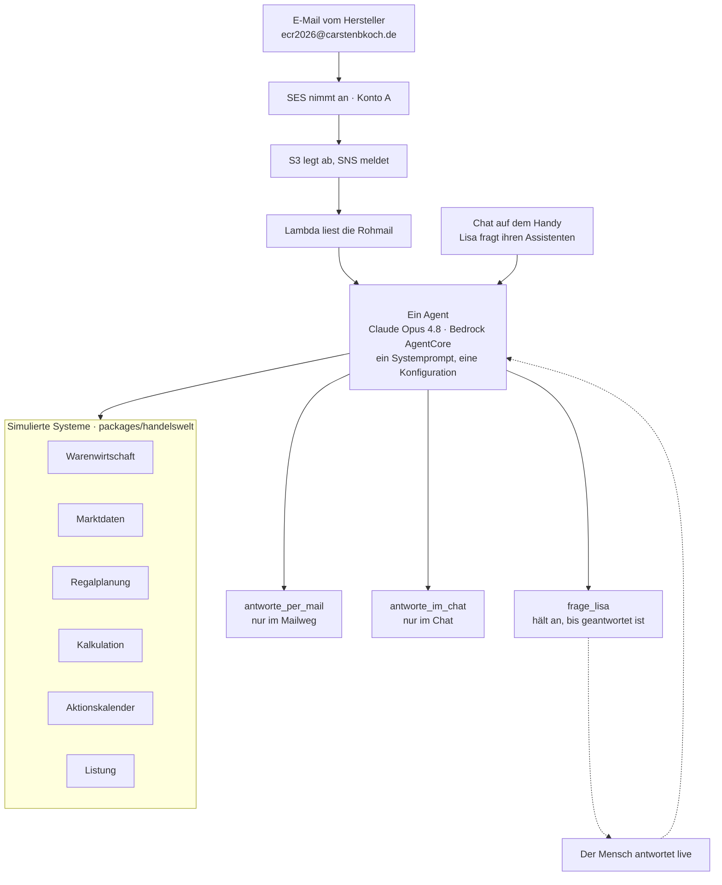

# Warum Dein KI-Agent noch keine Aufgaben für Dich übernimmt

**…und wie Du dahin kommst.** — Vortrag auf der ECR in Motion 2026, Hamburg,
16. September 2026.

Lisa Berger ist Category Managerin für Schokolade & Pralinen bei einer
Lebensmittelkette. An einem Freitagnachmittag bekommt sie eine E-Mail: Ein
Hersteller will ein neues Produkt exklusiv einführen. Einkaufspreis,
Verkaufspreis, Mindestabnahme, Wunschtermin. Rückmeldung bis Ende nächster
Woche.

Der Vortrag geht dieser einen Mail nach — und zeigt live, was ein Agent damit
anfangen kann, was er dabei erfindet, und woran es liegt. Das Publikum schreibt
selbst an den Agenten und sieht die Antworten auf der Leinwand.

| Block | | |
|---|---|---|
| 1 | **Provokation** | KI wird Dir Deinen Job wegnehmen |
| 2 | **Entwarnung** | …wird Dir Deinen Job wegnehmen |
| 3 | **Beweis** | KI wird Dir Deinen Job *erleichtern* |
| 4 | **Veränderung** | KI wird Deinen Job *verändern* |

## Was in diesem Repository liegt

Vier Dinge, und sie hängen zusammen:

| | Wo | Was |
|---|---|---|
| **Die Präsentation** | `packages/presentation/src/` | Die Folien als Web-App — Live-View für den Beamer, Operator-View für den zweiten Bildschirm, Teilnehmersicht fürs Handy. Die Foliendaten in `src/slides/data.ts` sind die Quelle der Wahrheit, auch fürs Storyboard. |
| **Der Agent** | `packages/presentation/aws-blocks/agent/` | Eine Definition, zwei Eingangswege. `werkzeuge.ts` die Fachwerkzeuge, `antwort.ts` die Antwortwerkzeuge samt Rückfrage an den Menschen, `index.ts` die gemeinsame Konfiguration. |
| **Die simulierten Systeme** | `packages/handelswelt/` | Warenwirtschaft, Marktdaten, Regalplanung, Kalkulation, Aktionskalender, Listung — jedes hinter einem Port, der einen `Befund` liefert statt zu werfen. Dazu 81 Artikel Sortiment und das Zeitmodell. |
| **Die AWS-Infrastruktur** | `packages/infra/`, `packages/presentation/aws-blocks/index.cdk.ts` | Bootstrap (OIDC-Rolle für den Deploy, Hosted Zone, Marken-Eimer) und die CDK-Schicht des Vortrags. Die E-Mail-Infrastruktur liegt daneben in `packages/mail-infra/` und ist hier **nicht** verdrahtet. |

Dazu: `packages/docs/` mit Vortragsverlauf, Storyboard und den **Messungen** —
was der Agent in 85 echten Läufen tatsächlich geantwortet hat, mit Zahlen.

## Wie es gebaut ist

Ein Agent, zwei Eingänge. Was ihn im Postfach von dem im Chat unterscheidet, ist
nicht, wer er ist — sondern **womit er antworten kann**. Modell, Systemprompt
und die sieben Fachwerkzeuge sind geteilt.



**Die Systeme sind simuliert. Die Arbeit des Agenten ist es nicht.** Welches
System er befragt, in welcher Reihenfolge und was er aus den Antworten schließt,
entscheidet er selbst.

Drei Eigenschaften, die nicht zufällig so sind:

- **Ein Port wirft nicht.** Jedes System antwortet mit einem `Befund` — bei
  Erfolg mit `quelle` und `stand`, sonst mit einem Grund, den der Agent
  aussprechen kann. Ein Fehler, den die Werkzeugschleife verschluckt, kommt als
  erfundene Zahl wieder heraus.
- **Die Vertraulichkeitsregel steht am Werkzeug, nicht im Prompt.** Sie gilt
  nicht für den Agenten, sondern für den Kanal: Eine Mail geht an einen
  Außenstehenden, eine Chatnachricht an Lisa selbst. Wer das Werkzeug nicht hat,
  kann die Regel nicht verletzen.
- **`frage_lisa` hält den Agenten an.** Mitten im Vorgang, bis ein Mensch
  geantwortet hat — und diese Antwort wird zum Werkzeugergebnis, mit dem er
  weiterrechnet.

## Lokal laufen lassen

Node 24 (siehe `.nvmrc`) und pnpm 12:

```bash
nvm use
pnpm install
pnpm --filter @ecr-talk/presentation dev
```

| Fenster | Adresse | Zweck |
|---|---|---|
| **Live-View** | `localhost:5180` | Auf den Beamer. Feste Bühne 1920×1080, skaliert sich auf jedes Bild. |
| **Operator-View** | `localhost:5180/?operator` | Auf den zweiten Bildschirm. Vorschau der aktuellen und nächsten Folie, Sprechernotizen, Uhr, Foliensprung. |
| **Teilnehmersicht** | `localhost:5180/` | Was das Publikum auf dem Handy sieht. |

Beide Fenster halten sich über einen `BroadcastChannel` synchron — kein Server
nötig, solange sie im selben Browser laufen. Wer klickt, ist egal.

Steuerung: `→` / `Leertaste` / `Bild ab` vor, `←` / `Bild auf` zurück, `Pos1` /
`Ende` an die Ränder. Bild-auf und Bild-ab heißt: handelsübliche
Presenter-Clicker funktionieren. `F` schaltet die Live-View auf Vollbild.

### Damit der Agent auch wirklich antwortet

Die Folien laufen ohne alles. Der Agent nicht — er braucht drei Dinge:

**1. Das Blocks-Backend**, denn dort lebt er:

```bash
pnpm --filter @ecr-talk/presentation dev:blocks     # Port 3000
```

**2. AWS-Zugangsdaten in der Umgebung dieses Servers.** Ohne sie scheitert
Bedrock still und AWS Blocks fällt auf seinen eingebauten Attrappen-Provider
zurück — im Chat steht dann wörtlich *„This is a canned mock response. No real
model was called."* Das ist kein Fehler, sondern der Rückfall. Er sieht nur
genauso aus wie einer.

```bash
AWS_PROFILE=<dein-profil> pnpm --filter @ecr-talk/presentation dev:blocks
```

**3. Zugriff auf das Modell.** Der Agent läuft auf
`global.anthropic.claude-opus-4-8` über ein globales Bedrock-Inferenzprofil.
Ob Dein Konto es hat:

```bash
aws bedrock list-inference-profiles --region eu-central-1 \
  --query "inferenceProfileSummaries[?contains(inferenceProfileId,'opus')].inferenceProfileId"
```

Ein einzelner echter Aufruf, der genau die Konfiguration des Agenten prüft —
kostet weniger als einen Zehntelcent:

```bash
AWS_PROFILE=<dein-profil> pnpm --filter @ecr-talk/presentation modell:test
```

Der **Mailweg** läuft lokal gar nicht: Er braucht die E-Mail-Infrastruktur aus
`packages/mail-infra/`, und die ist hier nicht verdrahtet. Der Chat auf dem
Handy zeigt denselben Agenten mit denselben Werkzeugen.

## In der eigenen AWS-Umgebung hosten

### Ein Profil anlegen

Alle Befehle hier nehmen `AWS_PROFILE`. Ein Eintrag in `~/.aws/config`:

```ini
[profile ecrtag]
region = eu-central-1
output = json
```

Wie die Anmeldedaten dazukommen, hängt von Deiner Organisation ab. Mit
IAM Identity Center (SSO):

```ini
[sso-session meine-org]
sso_start_url = https://<deine-org>.awsapps.com/start
sso_region = eu-central-1
sso_registration_scopes = sso:account:access

[profile ecrtag]
sso_session = meine-org
sso_account_id = <konto-id>
sso_role_name = <rollenname>
region = eu-central-1
output = json
```

Danach `aws sso login --profile ecrtag`. Prüfen:

```bash
AWS_PROFILE=ecrtag aws sts get-caller-identity
```

### Bootstrap: die Dinge, die vor dem ersten Deploy stehen müssen

`packages/infra/` legt an, was ein Workflow nicht selbst anlegen kann — die
Rolle, die er annimmt, gibt es sonst noch nicht, wenn er sie braucht:

- die **OIDC-Rolle** für GitHub Actions, eingeschränkt auf den Hauptzweig
  genau dieses Repositories,
- die **Hosted Zone**, gegen die das Zertifikat geprüft wird,
- einen privaten **Eimer für Markenmaterial** (Schrift und Logo liegen nicht im
  Repo).

Domain, Region und Repo stehen in `packages/infra/config.ts`. Das ist die eine
Datei, die Du anfassen musst.

```bash
AWS_PROFILE=ecrtag pnpm --filter @ecr-talk/infra deploy
```

### Die Anwendung ausrollen

```bash
DECK_TOKEN="..." AWS_PROFILE=ecrtag pnpm --filter @ecr-talk/presentation run deploy
```

Das stellt CloudFront und S3 für die App bereit, AppSync Events für die
Fernsteuerung und den Agenten auf Bedrock AgentCore.

**`DECK_TOKEN` nicht vergessen** — ohne das Geheimnis kann jeder mit der Adresse
die Folien weiterklicken. Die CDK-Schicht warnt beim Synthetisieren, und die
Operator-View zeigt im Kopf, ob die Steuerung geschützt ist.

> `pnpm run deploy`, nicht `pnpm deploy`. Letzteres ist ein eingebauter
> pnpm-Befehl und verdeckt das Skript aus der `package.json`.

Zum Ausprobieren ohne vollen Deploy:

```bash
AWS_PROFILE=ecrtag pnpm --filter @ecr-talk/presentation sandbox
```

### Der Mailweg, wenn Du ihn willst

`packages/mail-infra/` beschreibt, was dafür im Domain-Konto stehen muss, und
nennt die vier Werte, die als GitHub-Secrets zurückkommen. Fehlt auch nur einer,
legt die CDK-Schicht den Mail-Handler gar nicht erst an — ein halb verdrahteter
Mailweg wäre schlimmer als gar keiner.

## Prüfen

```bash
pnpm --filter @ecr-talk/handelswelt run ports:test      # die Systeme gegen die Folien
pnpm --filter @ecr-talk/handelswelt run marken:test     # keine echten Marken in den Daten
pnpm --filter @ecr-talk/presentation run buendel:test   # bündelt der Handler?
pnpm --filter @ecr-talk/presentation run mail:test      # der Mailweg, gegen eine Attrappe
pnpm --filter @ecr-talk/presentation run buehne:test    # sitzt die Bühne auf jedem Format?
AWS_PROFILE=… pnpm --filter @ecr-talk/presentation run modell:test   # echter Bedrock-Aufruf
```

Der letzte ist der einzige, der Geld kostet, und der einzige, der findet, wenn
ein Modell die Konfiguration nicht mehr annimmt. Die anderen laufen gegen
Attrappen und bleiben grün, während jeder echte Aufruf scheitert — das ist
genau so passiert, beim Wechsel von Sonnet auf Opus.

## Storyboard und Screenshots

```bash
pnpm --filter @ecr-talk/docs storyboard                 # aus den Foliendaten erzeugt
pnpm --filter @ecr-talk/presentation shots              # alle Folien als PNG
```

`shots` meldet auch, welche Folien zu voll für die Bühne sind.

## Hinweis zum Sortiment

`packages/handelswelt/src/daten/sortiment.ts` ist erzeugt, nicht von Hand
gepflegt. Vorlage, Zuordnungsliste und Erzeuger liegen **ausserhalb** dieses
Repos; hier steht nur das Ergebnis — 81 Artikel mit echten Warengruppen, Größen
und Preislagen, aber ohne einen einzigen echten Markennamen. Geprüft wird das
mit `marken:test`, gegen eine Sperrliste, die als Hashes vorliegt: Eine lesbare
Liste verriete durch ihre Zusammensetzung, was in der Vorlage stand.
