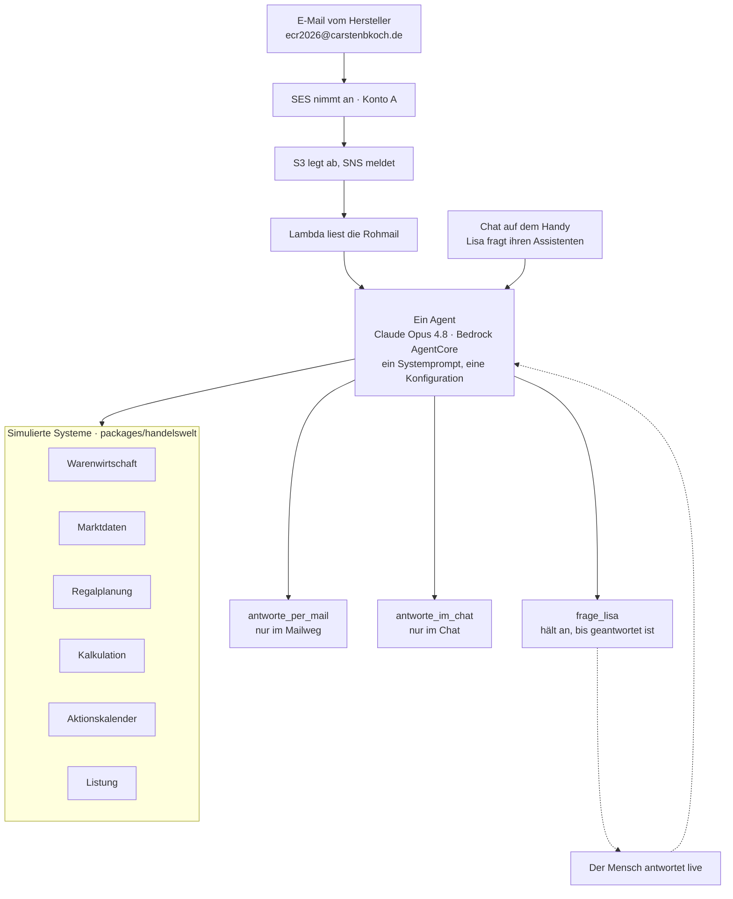

# ECR in Motion 2026 – Talk

pnpm-Workspace für den Vortrag „ECR in Motion 2026".

## Wie es gebaut ist

Ein Agent, zwei Eingänge. Was ihn im Postfach von dem im Chat unterscheidet, ist
nicht, wer er ist — sondern **womit er antworten kann**. Modell, Systemprompt
und die sieben Fachwerkzeuge sind geteilt.



**Die Systeme sind simuliert. Die Arbeit des Agenten ist es nicht.** Welches
System er befragt, in welcher Reihenfolge und was er aus den Antworten schließt,
entscheidet er selbst.

Drei Eigenschaften, die nicht zufällig so sind:

- **Ein Port wirft nicht.** Jedes System antwortet mit einem `Befund` — bei
  Erfolg mit `quelle` und `stand`, sonst mit einem Grund, den der Agent
  aussprechen kann. Ein Fehler, den die Werkzeugschleife verschluckt, kommt als
  erfundene Zahl wieder heraus.
- **Die Vertraulichkeitsregel steht am Werkzeug, nicht im Prompt.** Sie gilt
  nicht für den Agenten, sondern für den Kanal: Eine Mail geht an einen
  Außenstehenden, eine Chatnachricht an Lisa selbst. Wer das Werkzeug nicht hat,
  kann die Regel nicht verletzen.
- **`frage_lisa` hält den Agenten an.** Mitten im Vorgang, bis ein Mensch
  geantwortet hat — und diese Antwort wird zum Werkzeugergebnis, mit dem er
  weiterrechnet.

## Struktur

```
packages/
  docs/           Vortragsunterlagen, Messungen, Storyboard
  handelswelt/    Die simulierten Systeme — Daten hinter Ports
  infra/          Bootstrap: OIDC-Rolle, Hosted Zone, Marken-Eimer
  presentation/   Die Präsentation als Web-App, der Agent und der Mailweg
```

## Die Präsentation

```bash
pnpm --filter @ecr-talk/presentation dev
```

| Fenster | Adresse | Zweck |
|---|---|---|
| **Live-View** | `localhost:5180` | Auf den Beamer. Feste Bühne 1920×1080, skaliert sich auf jedes Bild. |
| **Operator-View** | `localhost:5180/?operator` | Auf den zweiten Bildschirm. Vorschau der aktuellen und nächsten Folie, Sprechernotizen, Uhr, Foliensprung. |

Beide Fenster halten sich über einen `BroadcastChannel` synchron — kein Server
nötig, solange beide im selben Browser laufen. Wer klickt, ist egal: die
Navigation geht in beide Richtungen.

### Steuerung von einem anderen Gerät

Für die Steuerung vom Handy reicht der BroadcastChannel nicht — dafür gibt es
einen zweiten Transport über **AWS Blocks Realtime**. Er wird mit `?remote`
eingeschaltet:

```bash
pnpm --filter @ecr-talk/presentation dev:blocks    # Blocks-Dev-Server, Port 3000
```

| Fenster | Adresse |
|---|---|
| Live-View | `localhost:3000/?remote` |
| Operator-View | `localhost:3000/?operator&remote&token=…` |

Lokal ist das ein WebSocket-Server im Prozess, in AWS sind es AppSync Events.
Ein Gerät, das sich mitten im Vortrag verbindet, holt sich den aktuellen Stand
und springt sofort auf die richtige Folie.

**Der Standardweg bleibt der BroadcastChannel.** Er braucht kein Netz und kein
Backend und kann am Vortragsabend nicht ausfallen. `?remote` ist die Zugabe,
nicht die Grundlage.

## Deployment

```bash
pnpm --filter @ecr-talk/presentation sandbox      # nur Backend, Hot-Swap
DECK_TOKEN="..." pnpm --filter @ecr-talk/presentation deploy
```

`deploy` stellt CloudFront + S3 für die App und AppSync Events für die
Fernsteuerung bereit. **`DECK_TOKEN` nicht vergessen** — ohne das Geheimnis
kann jeder mit der Adresse die Folien weiterklicken. Die CDK-Schicht warnt
beim Synthetisieren, wenn es fehlt, und die Operator-View zeigt im Kopf an,
ob die Steuerung geschützt ist.

Steuerung in beiden Fenstern: `→` / `Leertaste` / `Bild ab` vor, `←` / `Bild auf`
zurück, `Pos1` / `Ende` an die Ränder. Bild-auf und Bild-ab bedeutet, dass
handelsübliche Presenter-Clicker funktionieren. In der Live-View schaltet `F`
auf Vollbild; in der Operator-View gibt es einen Vollbild-Knopf an der
aktuellen Folie, um eingebettete Anwendungen in Originalgröße zu bedienen.

Screenshots aller Folien: `pnpm --filter @ecr-talk/presentation shots`
(meldet auch, welche Folien zu voll für die Bühne sind).

## Storyboard

Das Storyboard-Artefakt wird aus den Foliendaten der App erzeugt — die App ist
die Quelle der Wahrheit:

```bash
pnpm --filter @ecr-talk/docs storyboard
```

## Setup

Node 24 (LTS „Krypton", siehe `.nvmrc`) und pnpm 12:

```bash
nvm use          # nimmt 24.21.0 aus .nvmrc
pnpm install
```

## Hinweis zum Sortiment

`packages/handelswelt/src/daten/sortiment.ts` ist erzeugt, nicht von Hand
gepflegt. Vorlage, Zuordnungsliste und Erzeuger liegen ausserhalb dieses
Repos; im Repo steht nur das Ergebnis. `pnpm --filter @ecr-talk/handelswelt
run marken:test` prüft, dass darin kein gesperrter Name vorkommt.
